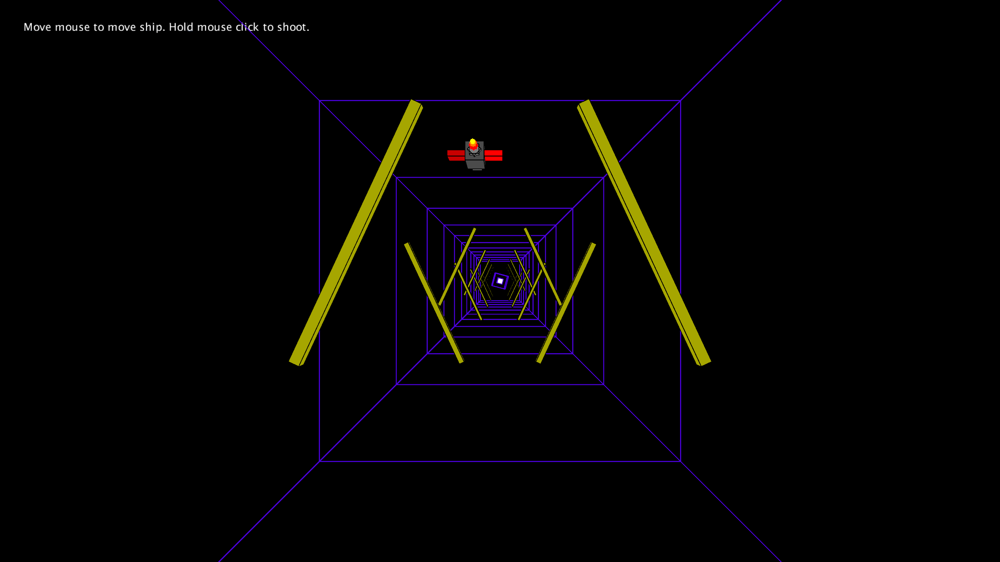
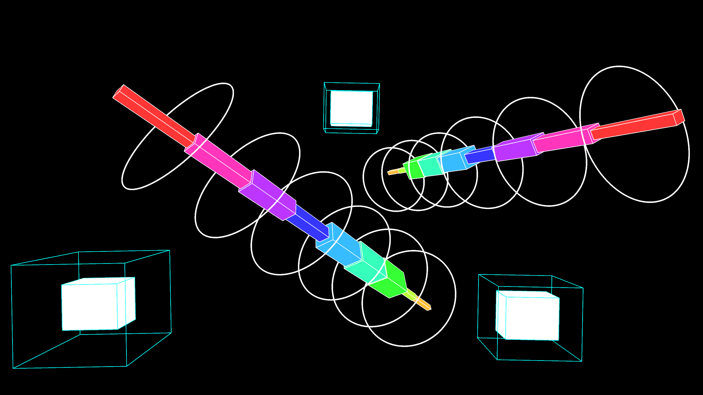

# Music Visualiser Project
- Name: Bongani Moyo
- Student Number: C20309081
- Name: Nelson Ude
- Student Number: C20479276
- Name: David Davitashvili
- Student Number: C20406272

# Video
[](https://youtu.be/GHtYQEfOZCk)

## Instructions
Run the main.java file 
- To start the program the space button is to be pressed.
- You can change the visuals by using the keys 1 and 2.
- If you would like to restart the song you press the "r" key.
- In scene 1 of the visualization you can control the spaceship by using the mouse and then to shoot you press the mouse as many times as you want to release the bullet.

# Description of the assignment
In this assignment we have 2 visualisations using java processing. We all helped each other for the visuals and different aspects of the coding and also the thought process of each idea and how we layed it out. Our visuals respond to the amplitude of the music and the user is given options on what they want to do presented by a menu at the start of the program run and it changes colours, shapes etc.

# How it works
Each visualisation has its own java file and class which is all connected to the main class called mula (our song choice). A switch statement is what lets the user switch between the visuals. Both visuals have a render() method to display these scenes.

```Java
switch(drawMode)
	{
		case 1:
		{
			fill(255);
			noStroke();
			textSize(width/90);
			textAlign(CENTER, CENTER);
			text("Move mouse to move ship. Hold mouse click to shoot.",width/6,height/22);
			
			colorMode(RGB);
			hw.render();

			break;
		}
		case 2:
		{
			fb.render();

			break;
		}
	}
```
### Visual 1
The first visual uses the bass to move the cubes that are stacked beside each other towards the user, giving the illusion of a hallway. The rocket ship was made with boxes that were attached to the mouse's x and y locations for the user to control freely as they fly towards a rotating cube. The rotation of the cube was dependant on the bass also. The ship also has a shooting feature where a line is shot from rocket along the negative z-axis. The bars on the top and bottom were alternated by checking if *i* is even or odd. These bars used the mids of the song to light up in a glowstick-like colour.



### Visual 2
The second visual uses all frequencies of the song. The bands are 3D and rotated using the bass on its x-axis to give it spin. The circles around the bands are also bands themselves. The three cubes have different frequencies controlling the size along the x, y and z axes. 



# What we are most proud of in the assignment
We are mostly proud of how well our team worked regardless of how different our skills in coding were and also how well the visuals turned out especially the hallway visual.